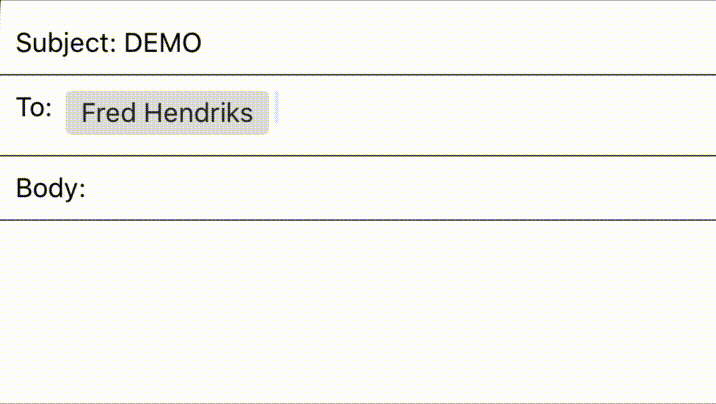

# react-native-autocomplete-tags

A quick and easy solutions for projects that need an input with both autocomplete and tags



## Features

- custom tag and suggestions components
- separate extractors for tags and for suggestions
- easy to integrate and use
- configurable

## What's new in version 2?

- no more mandatory controlled TextInput (although you still can if you want)
- TypeScript support!
- no more tag/suggestion styles - if you need custom styles, use `renderTag` or `renderSuggestion` instead

## Installation

```
yarn add react-native-autocomplete-tags
```

or

```
npm install react-native-autocomplete-tags --save
```

## Dependency

**Requires RN >= 0.63**
If using RN < 0.63, use v1 instead.

## Useage

Also see [the demo projects](demo)

```jsx
const suggestions = ['apple', 'orange', 'banana', 'kiwi'];

const SimpleExample = () => {
  const [tags, setTags] = useState<string[]>([]);

  const labelExtractor = (tag: string) => tag;

  return (
    <AutocompleteTags
      tags={tags}
      suggestions={suggestions}
      onChangeTags={setTags}
      labelExtractor={labelExtractor}
    />
  );
};

export default SimpleExample;

```

## Props

| Prop                      | type                                                                      | Description                                                                           | required | default                                                  |
|---------------------------|---------------------------------------------------------------------------|---------------------------------------------------------------------------------------|----------|----------------------------------------------------------|
| **`tags`**                | `Tag[]`                                                                   | The current tags to be rendered                                                       | yes      |                                                          |
| **`labelExtractor`**      | `(tag: Tag) => string`                                                    | Determines what property of `tags` is displayed                                       | yes      |                                                          |
| **`onChangeTags`**        | `(newTags: Tag[]) => void`                                                | called when tags change (i.e. by deleting), should be used to set `tags`              | yes      |                                                          |
| **`suggestions`**         | `Suggestion[]`                                                            | All possible suggestions                                                              | no       | `[]`                                                     |
| **`suggestionExtractor`** | `(suggestion: Suggestion) => string`                                      | determines which property of `suggestions` is displayed                               | no       | uses `labelExtractor`                                    |
| **`onSuggestionPress`**   | `(suggestion: Suggestion) => void`                                        | called when suggestion is pressed                                                     | no       | calls `onChangeTags` with `[...tags, pressedSuggestion]` |
| **`onTagPress`**          | `(tag: Tag) => void`                                                      | called when tag is pressed                                                            | no       | calls `onChangeTags` with the pressed tag removed        |
| **`renderSuggestion`**    | `(suggestion: Suggestion, onPress: (tag: Suggestion) => void) => Element` | renders a custom suggestion component                                                 | no       |                                                          |
| **`renderTag`**           | `(tag: Tag, onPress: (tag: Tag) => void) => Element`                      | renders a custom tag component                                                        | no       |                                                          |
| **`filterSuggestions`**   | `(text: string) => Suggestion[]`                                          | filters suggestions based on users text input                                         | no       |                                                          |
| **`inputProps`**          | `TextInput` props                                                         | any additional props for `TextInput`                                                  | no       |                                                          |
| **`flatListProps`**       | `FlatList` props                                                          | any additional props for `FlatList`                                                   | no       |                                                          |
| **`allowCustomTags`**     | `boolean`                                                                 | whether or not to allow the user to create a Tag that doesn't come from `suggestions` | no       | `true`                                                   |
| **`parseChars`**          | `string[]`                                                                | an array of characters that should trigger a new tag and clear the TextInput          | no       | `[',', ' ', ';', '\n']`                                  |
| **`onAddNewTag`**         | `(userInput: string) => void`                                             | called when the user types a character in `parseChars`                                | no       | calls `onChangeTags` with `[...tags, userInputText]`     |

### Style Props

No style props are required.

| Prop                    | Description                                                                         |
|-------------------------|-------------------------------------------------------------------------------------|
| **`containerStyle`**    | style for the outer-most View that houses both the tagContainer and suggestion list |
| **`tagContainerStyle`** | Container for the `tags` and the `TextInput`                                        |
| **`inputStyle`**        | Applied to the `TextInput` directly                                                 |
| **`flatListStyle`**     | Applied to the `FlatList` which renders suggestions                                 |

## Contributing

PRs and issues welcome!
